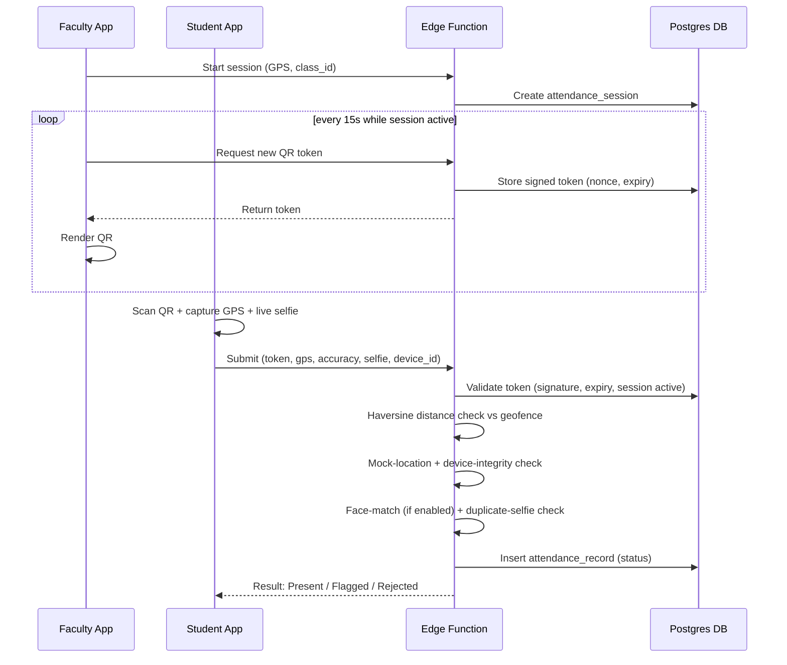
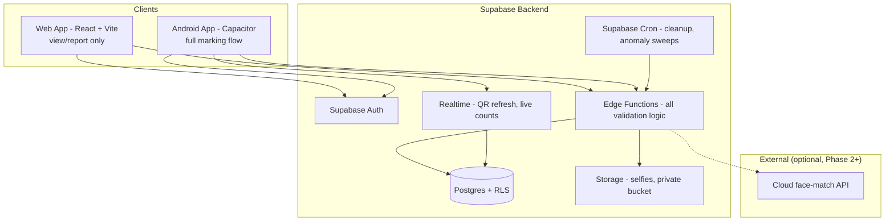

# AttendX — Verified Attendance System
### Product Requirements Document (v1.0)

> **Working title.** "AttendX" is a placeholder — rename freely. This doc is written to be handed directly to an implementation agent (Claude Code, etc.) — every module below maps to a buildable slice.

| | |
|---|---|
| **Owner** | Mohit Sharma |
| **Platforms** | Web App + Android (Capacitor) |
| **Backend** | Supabase (Postgres, Auth, Storage, Realtime, Edge Functions) |
| **Status** | Draft for implementation |
| **Date** | July 2026 |

---

## 1. Executive Summary

AttendX replaces manual roll-call with a QR-based check-in flow: Faculty starts a class session and projects a rotating QR code; students scan it and submit a live GPS reading plus a live selfie; a server-side function validates all three signals (QR authenticity, physical proximity, identity) before marking anyone present. An Admin layer oversees all users, all attendance data, and a dispute/report queue for contested entries.

The hard part of this product isn't the happy path — scanning a QR and marking attendance is a weekend build. **The hard part is that every piece of the happy path is also the easiest thing to fake** (a screenshot of a QR, a spoofed GPS pin, a friend's photo held up to a camera). Section 7 is written to be the most detailed part of this document for that reason, and the guiding principle throughout is stated up front so it doesn't get lost:

> **No consumer-phone attendance system is 100% unspoofable.** A rooted device, a fake-GPS app, and a cooperative friend can always find *some* gap, in any system, from any vendor. The realistic goal isn't a perfect lock — it's **defense in depth**: stack enough independent, server-verified signals that cheating requires more coordinated effort than just attending class, and make sure whatever slips through gets caught by review/anomaly detection rather than being invisible forever.

---

## 2. Problem Statement, Goals & Non-Goals

**Problem.** Manual roll-call is slow, trivially proxied ("buddy punching"), and leaves faculty/admin with no evidence trail when a dispute happens. Institutions need a fast way to confirm a *specific enrolled student* was *physically present* at a *specific session*, with proof.

**Goals**
- Cut attendance-marking time to seconds per student.
- Make proxy/remote fraud require real technical effort — not something a friend can do by tapping "share screenshot."
- Give faculty/admin an auditable record with evidence attached to every entry.
- Give students visibility into their own attendance % and a fair, fast way to dispute an error.
- Ship a working MVP fast, then layer stronger fraud detection (Section 14).

**Non-Goals (MVP)**
- Not an LMS/gradebook — attendance only.
- Not claiming unbeatable liveness/anti-spoofing on day one (see the framing above).
- Single-institution deployment; the schema shouldn't *preclude* multi-tenant later, but multi-tenant UI/billing is out of scope now.
- No fully offline attendance marking — the core check inherently needs a live server round-trip (see 7.7). Viewing schedules/history offline is fine.
- iOS is not in scope (Capacitor makes it a relatively low-incremental-cost future add if you want it later — same codebase, different plugin permissions/build).

---

## 3. Users, Roles & Permissions

| Capability | Student | Faculty | Admin |
|---|:---:|:---:|:---:|
| View own schedule / classes | ✅ | ✅ (own classes) | ✅ (all) |
| Start a session / generate QR | ❌ | ✅ (own classes) | ❌ |
| Mark attendance | ✅ (self only) | ❌ | ❌ |
| View attendance history | ✅ (own) | ✅ (own classes' students) | ✅ (all) |
| Manually override an entry | ❌ | ✅ (own classes, logged) | ✅ (all, logged) |
| File a dispute | ✅ | — | — |
| Resolve disputes | ❌ | ✅ (first line) | ✅ (escalation) |
| Create/manage user accounts | ❌ | ❌ | ✅ |
| Reset another user's credentials | ❌ | ❌ | ✅ |
| View analytics | ❌ | ✅ (own classes) | ✅ (all) |
| Configure system settings | ❌ | ❌ | ✅ |

Accounts are **provisioned by Admin only** (individually or CSV bulk import) — there is no public self-signup. This alone closes off an entire fraud category (fake student accounts) before it can start.

---

## 4. Core User Flows

### 4.1 Class Scheduling (Faculty / Admin)
1. Faculty or Admin creates a **Class** (name, code) and enrolls students (individually or CSV).
2. Faculty defines a recurring **Schedule** (day, time, room) or a one-off slot.
3. The schedule auto-appears on every enrolled student's dashboard.

### 4.2 Session Start & QR Generation (Faculty)
1. At class time, Faculty opens the scheduled class and taps **Start Session**.
2. The app captures Faculty's current GPS as the geofence center; Faculty confirms the room/radius.
3. The server creates an `attendance_session` row and begins issuing signed, rotating QR tokens (default: every 15s).
4. Faculty projects the QR; sees a live counter of students marked present.
5. Session ends manually, or auto-closes at scheduled end-time + grace period.

### 4.3 Attendance Marking (Student) — the critical path
1. Student gets a push notification / sees "Attendance Open" on their dashboard.
2. Student opens the in-app scanner and scans the currently-displayed QR.
3. App requests: **(a)** a live high-accuracy GPS fix, **(b)** a live selfie via camera only (no gallery picker).
4. The bundle (token, GPS, accuracy, selfie, device ID) goes to a server-side Edge Function — never a direct database write from the client (see 7.7).
5. Server validates token signature/expiry, geofence distance, mock-location flag, device binding, and (if enabled) face-match score.
6. Student sees an immediate result: **Present**, **Flagged for Review** (e.g., borderline GPS accuracy — recorded, held for confirmation), or **Rejected** (expired token, out of geofence) with a clear reason and a "Raise a Dispute" button.



### 4.4 Dispute / Correction Flow
1. A student who believes they attended but was marked absent/flagged taps **Raise a Dispute** on that session and adds a note.
2. Faculty is notified, reviews any evidence from the attempted submission alongside their own recollection, and resolves it (approve → status becomes Present; reject; or request more info).
3. Unresolved after N days, or on the student's request, it escalates to Admin, who has full cross-session visibility.
4. Resolution is written to `audit_logs`; the student is notified either way.

### 4.5 Admin: User & Credential Management
1. Admin creates/imports Faculty & Student accounts (CSV, mapping roll-no/employee-id → email).
2. Admin can deactivate an account (e.g., student left) without deleting their history.
3. If someone forgets their credentials, Admin triggers either **(a)** an automated password-reset email, or **(b)** a one-time temporary password shown once to Admin to relay securely, forcing a change on next login. Every action is written to `audit_logs`. *(See the callout in Section 10 — this replaces "Admin views the password," which isn't something a secure system can do.)*

---

## 5. Functional Requirements

### FR-AUTH — Authentication & Roles
- **AUTH-1**: Three roles — Admin, Faculty, Student — enforced via `profiles.role` + Row Level Security (RLS), not just UI hiding.
- **AUTH-2**: No public self-signup. Accounts are created by Admin only (individual or CSV bulk import).
- **AUTH-3**: Login via email/password (Supabase Auth). Roll-no/employee-id can be used as an alternate identifier mapped internally to the account's email.
- **AUTH-4**: A device fingerprint is recorded on first successful login per account (see 7.6).
- **AUTH-5**: Short-lived session tokens with refresh-token rotation (Supabase default behavior).

### FR-CLASS — Class & Schedule Management
- **CLASS-1**: Faculty/Admin create a Class with name, code, and an enrolled roster.
- **CLASS-2**: Faculty define recurring (day-of-week) or one-off Schedule entries (time, room).
- **CLASS-3**: Students see only classes they're enrolled in; today's/upcoming classes are surfaced first.

### FR-SESSION — Live Session & QR Generation
- **SESSION-1**: A session can only be started from an existing scheduled slot, within a defined window (e.g. −15 min to +class duration) — this alone blocks "starting a session" for a slot that was never scheduled.
- **SESSION-2**: On start, Faculty's GPS is captured as the geofence center; Faculty can adjust the radius within admin-configured bounds.
- **SESSION-3**: A new signed QR token is generated every `qr_refresh_interval_s` (default 15s) and rendered full-screen.
- **SESSION-4**: Faculty can end the session manually; it auto-closes at scheduled end + grace period.
- **SESSION-5**: Faculty sees a live count of students marked present during the session.

### FR-ATTEND — Attendance Capture (Student)
- **ATTEND-1**: Student scans the QR via the in-app scanner (camera-only).
- **ATTEND-2**: App requests high-accuracy GPS and a live selfie (camera source only, gallery disabled).
- **ATTEND-3**: The submission bundle is sent to an Edge Function for validation — the client never writes attendance rows directly.
- **ATTEND-4**: Student gets immediate feedback: Present / Flagged / Rejected, with reason and a dispute option.
- **ATTEND-5**: One record per (student, session) — a unique constraint means a duplicate scan just returns the existing status, it doesn't create a second row.

### FR-ADMIN — Administration
- **ADMIN-1**: Full CRUD on Faculty/Student accounts, with CSV bulk import.
- **ADMIN-2**: Deactivate/reactivate accounts.
- **ADMIN-3**: Trigger password reset or generate a one-time temp password — cannot retrieve an existing password (Section 10).
- **ADMIN-4**: Search/filter all attendance records (class, student, date range, status).
- **ADMIN-5**: Review flagged/disputed records with full evidence (selfie, GPS pin on a map, device history) and resolve them.
- **ADMIN-6**: Configure system settings — default geofence radius, QR refresh interval, face-match threshold, data-retention period.
- **ADMIN-7**: Every admin action is written to an audit log.

### FR-REPORT — Reporting & Disputes
- **REPORT-1**: Students can file a dispute against a session where they believe they submitted attendance but were marked absent/flagged.
- **REPORT-2**: Disputes route to Faculty first, escalate to Admin after N days or on student request.
- **REPORT-3**: Resolution updates `attendance_records.status` and notifies the student.
- **REPORT-4**: Attendance-% dashboards per student/class/faculty; a configurable-threshold defaulter list (Indian polytechnics/universities commonly use a 75% eligibility rule — worth exposing as a tunable setting, not hardcoding 75%).

### FR-NOTIF — Notifications
- **NOTIF-1**: Push notification to enrolled students when Faculty starts a session.
- **NOTIF-2**: Reminder if a session is ending soon and the student hasn't marked attendance.
- **NOTIF-3**: Notify a student when their dispute is resolved.
- **NOTIF-4**: Notify Admin of high-confidence fraud flags needing review.

---

## 6. Security & Anti-Cheating Architecture

This is the core of what you asked for, so it gets its own full section rather than being folded into generic "security notes."

### 6.1 Threat Model — what a determined student will actually try

| # | Threat | What it looks like | Primary mitigation |
|---|---|---|---|
| 1 | **QR screenshot sharing** | Photograph/screenshot the QR, send to an absent friend | Short rotation window (10–20s) **+** mandatory geofence check at scan time — by the time it's shared and opened, it's usually expired, and even if not, the friend isn't near the room |
| 2 | **GPS spoofing (fake-GPS apps)** | Mock-location app reports a fake position | Server checks Android's mock-provider flag; reject/flag mock locations; require a high-accuracy fix |
| 3 | **Buddy punching** | Student hands their phone to a friend, or logs into a friend's account on their own device | Live selfie tied to the session; device-binding flags one device used across multiple accounts |
| 4 | **Photo-of-photo selfie spoof** | Holding up a photo of the absent friend to the camera | Forced live camera capture (no gallery), on-device face-presence check, optional randomized liveness prompt, server-side face-match against an enrollment photo |
| 5 | **Second device per student** | Carrying a spare phone to mark for someone else | Device-binding limits per account + cross-account same-device anomaly flag |
| 6 | **Token forgery/replay** | Trying to fabricate or reuse a QR payload | Server-signed (HMAC) token with nonce + expiry; client cannot produce a valid signature |
| 7 | **Client-side bypass** | Tampering with app JS/APK to submit a fake "valid" flag | *All* validation logic runs server-side (7.7) — the client never gets to self-certify |
| 8 | **Device clock manipulation** | Changing the phone's clock to extend a window | Server uses its own clock for every expiry check; client-reported time is never trusted |
| 9 | **Recycled selfie** | Re-submitting a previously used photo | Perceptual-hash comparison against recent submissions flags repeats |
| 10 | **Scripted/mass submission** | Automated requests mimicking many students | Rate limiting per IP/device + timing-pattern anomaly detection |

### 6.2 QR Code Design

The QR never encodes raw, static data — it encodes a **server-signed, time-boxed token**:

```json
{
  "session_id": "b7e6f2b0-...-uuid",
  "iat": 1751439600,
  "exp": 1751439620,
  "nonce": "a1c9f0e2"
}
```
Signed with an HMAC-SHA256 secret that only the server holds. On scan, the Edge Function checks: signature valid → not expired → session still `active` → nonce not already recorded as processed. This defeats naive forgery outright; it does **not**, by itself, stop a screenshot being scanned within the rotation window — that's what the geofence check (6.3) closes.

**Rotation, not single-use.** The same QR is meant to be scanned by many students within its ~15s window — that's the point of projecting it. What must be single-use is the *(student, session)* pair, enforced by a unique constraint on `attendance_records`, so nothing about the token design should try to make the QR itself one-time-use.

### 6.3 Geolocation Verification

- Faculty's device GPS at session-start becomes the geofence center (`center_lat`, `center_lng`, configurable `radius_m` — default ~50m to absorb GPS error and indoor multipath).
- On scan, the student's device requests a high-accuracy fix; low-accuracy/cached readings (e.g. >100m accuracy) are held for review rather than auto-rejected, and the student is prompted to retry near a window.
- Server computes the Haversine distance between student and center; outside the radius → rejected or flagged depending on how far outside.
- **Android mock-location check**: Android's location API exposes whether a reading came from a mock provider (`Location.isFromMockProvider()`). This is a per-reading, native-Android-only signal — a small custom Capacitor plugin shim is the most reliable way to surface it, since the default web Geolocation API has no equivalent flag at all. Any reading flagged as mocked is auto-rejected.

> ⚠️ **Important asymmetry: Web vs. Android.** Browsers expose **no** mock-location signal whatsoever — anyone can override GPS coordinates via Chrome DevTools in about ten seconds, and there is no server-side way to detect that this happened on the web. The same goes for camera source restriction: native apps can hard-restrict to a live camera stream, while a browser's `capture` attribute is only a hint. **Recommendation: restrict live attendance-marking (QR scan → GPS → selfie) to the native Android app only.** Let the web app handle everything else — viewing schedules, history, disputes, and all Faculty/Admin functions — but don't offer it as a valid marking client, or if you do, treat every web-submitted record as inherently lower-trust in the anomaly scoring (7.6) rather than pretending it has the same guarantees.

### 6.4 Selfie / Face Verification

Capture is forced live: Capacitor's Camera plugin restricted to `CameraSource.Camera` (never `Photos`), so there's no gallery fallback to route around. A lightweight on-device face-presence check (single face detected, reasonably centered) can run before upload as a first-pass filter.

Matching the selfie against an enrollment photo is a separate, tunable layer — pick based on where you are in the roadmap:

| Approach | How it works | Cost | Privacy | Effort | Recommended phase |
|---|---|---|---|---|---|
| **Manual review** | Faculty/Admin spot-checks selfies against the roster photo | Free | Highest (no 3rd party) | Low | **Phase 1 (MVP)** |
| **Cloud API** (AWS Rekognition `CompareFaces`, Azure Face API) | Selfie + enrollment photo sent to a cloud endpoint, returns a similarity score | Pay-per-call | Medium — biometric data leaves your infra, needs a signed DPA + explicit consent | Medium | Phase 2 |
| **Self-hosted** (e.g. `face_recognition`/DeepFace on a small server) | Embeddings compared on infra you control | Hosting cost only | High — data never leaves your stack | High (ops overhead) | Phase 2/3 |
| **On-device** (TensorFlow Lite / ML Kit) | Matching happens on the student's phone | Free | Highest — raw biometrics never transmitted | Medium–High | Phase 3 |

> ⚠️ **Azure Face API specifically gates identity matching.** *Face Detection* (no identity) is open to anyone. *Face Identification* and *Face Verification* — the 1:1/1:N matching you'd actually need — require applying for Microsoft's **Limited Access** program, are only available on paid (S0/E0) tiers, and approval is at Microsoft's discretion for vetted use cases. Don't design around Azure Face matching until access is actually confirmed; budget extra lead time for the application, or default to AWS Rekognition / a self-hosted option if you need something available immediately. A lightweight, complementary option worth knowing about: Capawesome's `@capacitor-mlkit` suite (the same family as the barcode scanner in 8.2) also ships an on-device **Face Detection** plugin — good for the cheap "is there a real face here" pre-check even before you decide on a full matching provider.

**Storage & retention**: selfies go into a private Supabase Storage bucket (RLS-protected, signed URLs with short expiry for review), never a public bucket. Define a retention window (e.g., current semester + grace period) with scheduled deletion — don't keep biometric images "just in case" (this matters both for security exposure and for DPDP compliance, Section 11.3).

### 6.5 Device Binding & Anomaly Detection

- A device UUID is captured and bound to the account on first login. Policy choice: strict (1 device, changing requires Admin approval) or flexible (up to 2, flag on a 3rd).
- Server-side rules land suspicious records in an **Admin review queue** — not an automatic block, to avoid punishing genuine students for false positives:
  - Same device ID used by 2+ different student accounts in a short window → high-confidence buddy-punching flag.
  - Two records with near-identical GPS coordinates (matching to many decimal places — statistically implausible for two independent phones) submitted seconds apart → flag.
  - A selfie's perceptual hash matches a prior submission → flag.
  - A burst of submissions all within ~1–2 seconds of QR generation across many students → timing-anomaly flag.
- On Android, layer in Google's **Play Integrity API** (the current, actively maintained replacement for the deprecated SafetyNet Attestation) as a device/app-integrity signal — it returns verdicts for whether the app is unmodified, installed via Play, and running on a genuine, non-tampered device, and Google positions it explicitly for fighting "fraud, cheating, and unauthorized access." Use it alongside the other signals, not as the single gate: sophisticated users on rooted devices can sometimes spoof even hardware-backed attestation using public tools, so treat it as one input to the anomaly score, the same as everything else in this list.

### 6.6 Rate Limiting & Session Integrity
- Edge Function endpoints are rate-limited per device/IP.
- QR tokens and their nonces are short-lived Postgres rows, cleaned up by a scheduled job (6.8) — an old token simply won't validate.

### 6.7 The Non-Negotiable Rule: Server-Side Enforcement Only

> ⚠️ Every check in this section — QR expiry, geofence distance, mock-location flag, device binding, rate limits, face-match — **must** run inside a server-side Supabase Edge Function using the `service_role` key. Never in client JS.
>
> A phone (especially rooted, or just a browser's dev console on the web build) can be made to report anything to your own front-end code. If the client computes "am I within 50m?" and just sends `is_valid: true` to the database, that check is worthless — bypassed in about thirty seconds with dev tools. **The client's only job is to collect data (QR content, GPS reading, selfie) and display the server's verdict. Every decision happens server-side.**
>
> Concretely in Supabase terms: don't give the `authenticated` role an `INSERT` policy on `attendance_records` at all. If no INSERT policy exists for that role, RLS denies it by default — the *only* way a row gets created is through the Edge Function running as `service_role`, after it's done all the validation above.

### 6.8 Scheduled Integrity Jobs

Use **Supabase Cron** (the dashboard UI over `pg_cron` + `pg_net`, supports schedules down to 1-second granularity and can invoke Edge Functions directly) for:
- Purging expired `qr_tokens`.
- Running the anomaly-detection sweep (6.5) periodically over the last window of records.
- Enforcing the selfie/data retention policy (Section 11.3).

---

## 7. Data Model (Supabase / Postgres)

Core schema — enough to scaffold real migrations from. Extend as needed.

```sql
-- Extends Supabase's built-in auth.users
create table public.profiles (
  id uuid primary key references auth.users(id) on delete cascade,
  role text not null check (role in ('admin','faculty','student')),
  full_name text not null,
  identifier text unique,            -- roll no / employee id
  phone text,
  is_active boolean default true,
  created_at timestamptz default now()
);

create table public.devices (
  id uuid primary key default gen_random_uuid(),
  user_id uuid references public.profiles(id) on delete cascade,
  device_uuid text not null,
  platform text,                     -- 'android' | 'web'
  is_trusted boolean default true,
  first_seen_at timestamptz default now(),
  last_seen_at timestamptz default now(),
  unique (user_id, device_uuid)
);

create table public.classes (
  id uuid primary key default gen_random_uuid(),
  name text not null,
  code text unique,
  faculty_id uuid references public.profiles(id),
  created_at timestamptz default now()
);

create table public.enrollments (
  id uuid primary key default gen_random_uuid(),
  class_id uuid references public.classes(id) on delete cascade,
  student_id uuid references public.profiles(id) on delete cascade,
  status text default 'active',
  unique (class_id, student_id)
);

create table public.class_schedules (
  id uuid primary key default gen_random_uuid(),
  class_id uuid references public.classes(id) on delete cascade,
  day_of_week int,                   -- 0-6, null for one-off sessions
  start_time time,
  end_time time,
  room text
);

create table public.attendance_sessions (
  id uuid primary key default gen_random_uuid(),
  class_id uuid references public.classes(id),
  faculty_id uuid references public.profiles(id),
  started_at timestamptz default now(),
  ended_at timestamptz,
  center_lat double precision not null,
  center_lng double precision not null,
  geofence_radius_m int default 50,
  qr_refresh_interval_s int default 15,
  status text default 'active' check (status in ('active','closed'))
);

create table public.qr_tokens (
  id uuid primary key default gen_random_uuid(),
  session_id uuid references public.attendance_sessions(id) on delete cascade,
  nonce text not null,
  issued_at timestamptz default now(),
  expires_at timestamptz not null,
  unique (session_id, nonce)
);

create table public.attendance_records (
  id uuid primary key default gen_random_uuid(),
  session_id uuid references public.attendance_sessions(id) on delete cascade,
  student_id uuid references public.profiles(id),
  marked_at timestamptz default now(),
  gps_lat double precision,
  gps_lng double precision,
  gps_accuracy_m numeric,
  distance_from_center_m numeric,
  is_mock_location boolean default false,
  selfie_path text,                  -- Storage path, not a public URL
  face_match_score numeric,
  device_id uuid references public.devices(id),
  ip_address inet,
  status text default 'pending_review'
    check (status in ('present','flagged','rejected','pending_review')),
  reviewed_by uuid references public.profiles(id),
  reviewed_at timestamptz,
  review_notes text,
  unique (session_id, student_id)
);

create table public.disputes (
  id uuid primary key default gen_random_uuid(),
  attendance_record_id uuid references public.attendance_records(id),
  student_id uuid references public.profiles(id),
  reason text not null,
  status text default 'open' check (status in ('open','approved','rejected')),
  resolved_by uuid references public.profiles(id),
  resolved_at timestamptz,
  resolution_notes text,
  created_at timestamptz default now()
);

create table public.audit_logs (
  id uuid primary key default gen_random_uuid(),
  actor_id uuid references public.profiles(id),
  action text not null,
  target_table text,
  target_id uuid,
  metadata jsonb,
  created_at timestamptz default now()
);

create table public.consents (
  id uuid primary key default gen_random_uuid(),
  user_id uuid references public.profiles(id),
  consent_type text check (consent_type in ('biometric','location')),
  granted_at timestamptz default now(),
  policy_version text
);
```

**Example RLS policies** — illustrating the pattern from 6.7 (client can read its own lane, but only the service role can write attendance):

```sql
alter table public.attendance_records enable row level security;

-- Students see only their own records
create policy "students_select_own"
on public.attendance_records for select
using (auth.uid() = student_id);

-- Faculty see records for sessions they own
create policy "faculty_select_own_sessions"
on public.attendance_records for select
using (
  exists (
    select 1 from public.attendance_sessions s
    where s.id = session_id and s.faculty_id = auth.uid()
  )
);

-- Deliberately no INSERT policy for 'authenticated' —
-- rows can only be created by the Edge Function via service_role.
```

---

## 8. System Architecture



### 8.1 Tech Stack

| Layer | Choice | Notes |
|---|---|---|
| Frontend | React + Vite + TypeScript + Tailwind | A **static SPA build**, not Next.js SSR — Capacitor loads local web assets in a WebView with no Node server at runtime, so Next's SSR/API-routes/middleware don't apply on-device. Static export is possible but throws those features away for no benefit here. |
| Mobile shell | Capacitor | Plugins: Camera, Geolocation (+ a small native shim for `isFromMockProvider`), Device, Push Notifications, Preferences (secure device-ID storage) |
| State | Zustand | |
| Backend | Supabase | Postgres, Auth, Storage, Realtime, Edge Functions |
| Server-side validation | Supabase Edge Functions (Deno/TS) | All fraud checks live here (6.7), invoked with `service_role` |
| QR generation | `qrcode` (npm) rendering a server-signed HMAC payload | |
| QR scanning | `@capacitor-mlkit/barcode-scanning` (Capawesome, on-device via Google ML Kit on Android, actively maintained) | Alternative: the Ionic team's `capacitor-barcode-scanner` |
| Device integrity (Android) | Play Integrity API | Current, actively-supported replacement for the deprecated SafetyNet |
| Face match (Phase 2+) | AWS Rekognition / self-hosted / on-device, per 6.4's comparison table | Confirm Azure access before depending on it |
| Notifications | Capacitor Push Notifications + Supabase | |
| Web hosting | Vercel / Netlify | |

---

## 9. Admin Panel — Detailed Requirements

- **User management**: CRUD for Faculty/Student, CSV bulk import/export, deactivate without deleting history, role assignment.

> ⚠️ **On "viewing" login credentials.** You asked for Admin to be able to see Faculty/Student passwords — worth flagging before it's built, not after. Modern auth (Supabase Auth included) stores passwords as one-way hashes; there is no "view password" operation for *anyone*, including Admin, and a system that *could* show them would mean passwords are stored reversibly — which is precisely the design flaw behind most large-scale breaches. What actually solves the underlying need, and what's specified above, is Admin being able to **(a)** force a password-reset email, or **(b)** issue a one-time temp password server-side (Supabase's admin API supports setting a user's password directly via `service_role`, just not reading it) — both fully audit-logged.

- **Attendance oversight**: search/filter all records; a map view plotting a session's GPS pins is a strong value-add here — a cluster of pins nowhere near the classroom is instantly obvious to a human reviewer in a way a table of coordinates isn't.
- **Review queue**: flagged/disputed records shown with full evidence (selfie, GPS pin, device history, distance-from-center) side by side; approve/reject with a reason, which updates `attendance_records.status`.
- **System configuration**: default geofence radius, QR refresh interval, face-match threshold, retention period — exposed as tunable settings (a `system_settings` table), not hardcoded, so they can be adjusted per building/room without a redeploy.
- **Analytics**: attendance % by class/student/faculty; a configurable-threshold defaulter list.
- **Audit log**: every admin action — credential resets, manual overrides, dispute resolutions — with actor, target, and timestamp.

---

## 10. Non-Functional Requirements

### 10.1 Performance & Scale
A single session (60–70 students scanning inside a 2–3 minute window) is trivial load for Postgres + Edge Functions. Scaling to an entire institution (thousands of students, many concurrent sessions) is still comfortably within Supabase's normal operating range — use the connection pooler (PgBouncer, enabled by default on hosted Supabase) for Edge Functions under load.

### 10.2 Security
- TLS everywhere (default on Supabase/Vercel); encryption at rest (Supabase default).
- **Never ship the `service_role` key in client code** — the single most common, most severe Supabase misconfiguration, and it hands out full database access if it leaks. It belongs only in Edge Function server-side environment secrets.
- Least-privilege service keys, secrets in Supabase Vault, rate limiting on all Edge Functions.

### 10.3 Privacy & Compliance (India — DPDP Act, 2023)

This system collects two categories that deserve explicit handling: **biometric data (selfies)** and **location data**. Current status as of mid-2026: the DPDP Rules, 2025 were notified on **13 November 2025**, and implementation is phased —a Data Protection Board is already operational, the consent-manager framework activates November 2026, and most day-to-day operational obligations (consent flows, breach notification, rights handling, children's-data provisions) become fully enforceable by **13 May 2027**. In practice, that makes **2026 the "build year"** — the sensible move is designing compliance in now rather than retrofitting it right before enforcement lands. This is general technical guidance, not legal advice — loop in the institution's legal/compliance contact before rollout, especially for anything biometric.

Practical implications for this build:
- **Explicit, informed consent** captured at enrollment for both biometric and location processing (an unticked checkbox, not a bundled ToS clause) — the `consents` table above exists for exactly this.
- **Purpose limitation & minimization**: selfies/location are used only for attendance verification, nothing else, and aren't retained indefinitely (Section 6.4's retention window).
- **Breach readiness**: DPDP requires notifying the Data Protection Board and affected individuals promptly (organizations are expected to report within a short window of becoming aware) — have an incident-response note ready even pre-enforcement.
- **Minors**: Diploma programs can include students who enter before turning 18. DPDP Act imposes extra conditions for processing children's personal data — including verifiable parental consent — and this is one of the higher-penalty categories in the Act. Confirm the age distribution of your enrolled students with the institution and adjust the consent flow accordingly if any are minors.

### 10.4 Availability
Attendance is time-boxed by nature (the class is happening *now*), so plan for graceful degradation: if a submission fails mid-flight, show a clear "retry" state rather than a silent failure, and make sure Faculty always has a manual-override path for tech outages so no student is unfairly marked absent because of a network blip — this ties directly into the dispute flow in 4.4.

---

## 11. MVP Phasing

**Phase 1 — MVP (core loop + baseline integrity)**
Auth + roles · Class/Schedule CRUD · CSV enrollment · Session start + rotating signed QR (fully server-validated) · GPS geofence check incl. mock-location flag · live selfie capture (stored, manual review only — no auto face-match yet) · basic Admin panel (user CRUD, credential reset, attendance browse, manual override) · student dashboard with own attendance %.

**Phase 2 — Fraud detection & workflow**
Automated face-match (cloud API) with a confidence threshold + human-review queue for borderline scores · device-binding + cross-account anomaly detection · full dispute/appeal workflow · push notifications · analytics dashboards, defaulter list, GPS map view.

**Phase 3 — Hardening & scale**
Perceptual-hash duplicate-selfie detection · submission-timing anomaly scoring · Play Integrity API integration · optional Wi-Fi/BLE indoor cross-check for GPS-weak buildings · configurable per-institution settings · on-device (privacy-preserving) face-match option.

---

## 12. Risks, Assumptions & Open Questions

- **Indoor GPS accuracy** in multi-story buildings can be poor (10–50m error). Start the geofence lenient (flag, don't reject) and tighten it with real usage data rather than guessing a number up front.
- **Face-match false positive/negative rates** depend heavily on lighting/angle — budget for the human-review fallback rather than fully automating rejections, at least initially.
- **Cloud face-match vendor access**: confirm Azure/AWS terms and approval status before committing a phase-2 timeline to it (6.4).
- **Minimum Android OS/device baseline** should be set based on your actual student device mix — plugin support (ML Kit, Play Integrity, Camera) generally needs a reasonably recent Android version and Google Play Services.
- **Institutional sign-off**: given biometric + location collection from students (some possibly minors), get the institution's legal/compliance buy-in before rollout — not just a technical launch.
- **Data residency**: confirm the institution's preference for Supabase project region.

---

## Appendix — Glossary

| Term | Meaning |
|---|---|
| Geofence | The allowed radius around Faculty's GPS position at session-start, within which a student's scan is considered "physically present" |
| Nonce | A random, single-use value embedded in each QR token to prevent replay |
| RLS | Row Level Security — Postgres/Supabase's mechanism for enforcing per-row access rules at the database layer |
| Liveness check | Any technique confirming a selfie was captured from a live camera in the moment, not replayed from a stored image |
| Defense in depth | Layering multiple independent, individually-imperfect checks so that beating all of them at once is much harder than beating any one |
